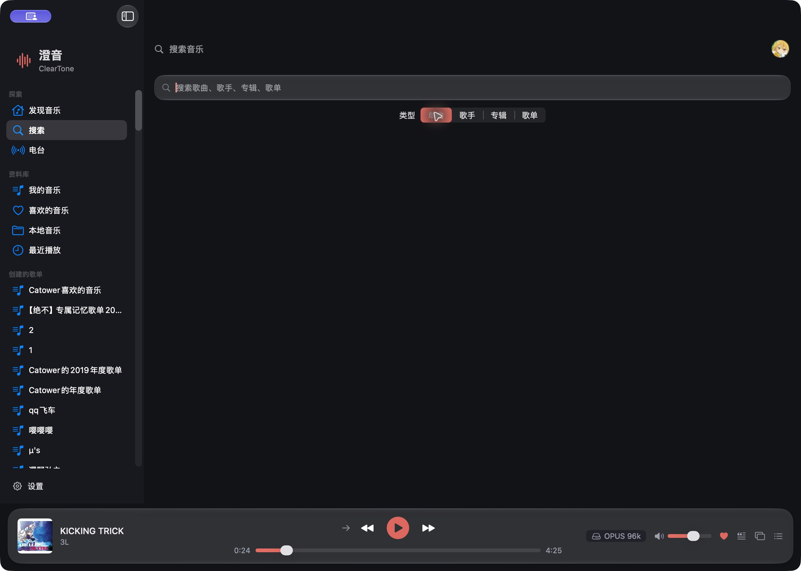
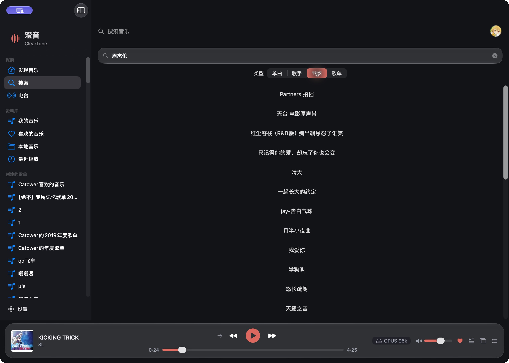

# 澄音深度审查 — 2026-09-25

结论：发现 2 项 P1、5 项 P2。当前测试通过不能作为 UI/UX 已完成的依据。本轮只审查并保存证据，未修改业务源码。

## 范围与证据

- 当前工作区源码，包含后续增加的电台、收藏、缓存及进度订阅改动；不是仅针对上轮 UI 改动的增量 diff。
- 实际界面：当前运行的 `/Applications/澄音.app`，保持原账户及播放队列。安装版与当前源码没有进行二进制一致性核验；下面分别标明界面复现和源码确认。
- 当前源码使用 Xcode 构建与 XCTest：163 tests，0 failures。默认命令因 app target 缺少 development team 停止；临时指定 `CODE_SIGN_IDENTITY=- CODE_SIGN_STYLE=Manual` 后通过，未更改项目签名设置。
- 日志：`/tmp/cleartone-deep-review-tests.log`；结果目录：`/tmp/cleartone-deep-review/Logs/Test/`。
- `project.yml` 的测试目标排除了 `MainWindow`、`PlayerBarView`、`MiniPlayerView` 和 `Features/**`，且部分测试使用独立模型；通过不证明界面状态或全部生产实现正确。

## 发现

### 1. P1 — 歌单首屏曲目与全量分页重复拼接（源码确认）

位置：`ClearTone/App/MainWindow.swift:1075–1085`；`ClearTone/Providers/Netease/NeteaseProvider.swift:247–260`。

首次打开未命中整表缓存、且详情只返回部分曲目的歌单时，`accumulated` 以详情曲目初始化；随后 `streamPlaylistTracks` 从第 1 页开始返回整张歌单，调用方又全部 append。首屏条目会重复。例如详情返回前 1000 首、总数 2808，则最终列表可包含 3808 项。`List` 的重复 Song ID 会破坏行身份，“播放全部”也会把重复曲目加入队列。整表缓存仅保存分页结果，因此第二次进入可能表现正常，掩盖首次加载问题。

建议：首屏只作临时展示；第一个全量批次到达后以分页序列重新组装，或明确从首屏之后的偏移分页。不要靠盲目按 ID 去重代替对分页顺序的处理。

验收：冷缓存、部分详情、多个乱序完成批次，最终曲目数和顺序与全量接口一致；首次和缓存命中再次进入结果一致；播放队列不增加额外副本。

### 2. P1 — 收藏加载缺少账户代次校验，退出后迟到响应仍可写回（源码确认）

位置：`ClearTone/App/AppState.swift:170–184`。

入口检查登录状态后，第一次 await 返回即写 `likedIDs`、本地缓存和 `hasLoadedLikes`，没有重新检查登录身份或取消状态。退出登录期间的迟到响应可重新写入已清空状态；若已登录另一账号，第二次 await 后仅检查 `isLoggedIn` 也会放行旧账号结果。登录恢复等调用并不随某个页面销毁而必然取消。歌单加载已有 token 保护，收藏加载没有。

建议：捕获账户 ID 与 session generation，每次 await 后、每次内存/磁盘提交前验证身份；退出和切换账号时作废请求。

验收：用受控延迟依次覆盖 A 请求→退出→响应、A 请求→登录 B→响应，A 的 IDs/歌曲/完成标志不能写入 B 或退出后的状态。不需要用真实账户执行破坏性复现。

### 3. P2 — 键盘清空搜索后切换分类出现无提示空白（实际复现）

位置：`ClearTone/Features/Search/SearchView.swift:33–55,66–70`。

步骤：搜索“周杰伦”→选择专辑→在输入框删光文字（不用右侧清空按钮）→选择单曲。输入改变没有清理 `result`；分类变化因空关键词跳过搜索，但显示分类已变成单曲。专辑结果仍使“全部结果为空”的判断为 false，随后按单曲渲染空数组，得到纯空白界面。只有清空按钮会调用 `resetSearch`，两种清空方式行为不一致。

建议：空白输入统一重置状态；结果渲染依据已提交类型，避免草稿类型与结果类型脱节。

验收：键盘删除、全选删除、清空按钮以及只剩空格时都进入同一初始提示，不能保留旧请求或渲染错类结果。

### 4. P2 — 歌手/专辑结果只有文字，不能进入内容（实际界面 + 源码确认）

位置：`ClearTone/Features/Search/SearchView.swift:205–215`。

专辑搜索实际只显示居中文字；辅助功能树同样只有 text，没有打开操作。歌手分支也是纯 `Text`。Provider 已有 `fetchAlbumDetail` / `fetchArtistDetail`，但 UI 没有对应导航入口，因此这两类搜索无法继续浏览歌曲或播放。

建议：接入详情导航和明确的可操作结果行；提供封面、作者等辨识信息。验收：鼠标及键盘均可从结果进入正确详情并播放其中曲目。

### 5. P2 — 非单曲搜索永远没有下一页（源码确认）

位置：`ClearTone/Features/Search/SearchView.swift:156–158,196–223`。

只有单曲最后一行触发 `onLoadMore`，歌单、专辑、歌手没有触发点；即便补触发器，合并代码也只 append `more.songs`。首次搜索固定 limit 30，因此其他类型超过首批的结果无法到达。

建议：所有类型共用可见的分页末尾控件，按 activeType 合并对应集合，同时展示加载/失败重试。验收：每一类型都能读取超过 30 项，查询切换时旧页不能混入。

### 6. P2 — 收藏详情失败后被标记为已加载，返回页面也无法重试（源码确认）

位置：`ClearTone/App/AppState.swift:172–186`；`ClearTone/App/MainWindow.swift:794–829`。

ID 请求成功后立即设置 `hasLoadedLikes = true`，后续歌曲详情失败只记日志。再次进入资料库会在方法入口提前 return；在线 LikedView 不设置自己的 isLoading/errorMessage，也不提供 force 刷新入口。无缓存时用户看到“还没有喜欢的歌曲”，有缓存时持续看到旧列表，网络恢复也不会自动重试。

建议：分别管理 ID 与详情加载状态，把错误/重试暴露给视图；失败不能标记详情完成。验收：ID 成功、详情失败、网络恢复后，无需退出账户或重启即可重试成功。

### 7. P2 — 队列行操作依赖鼠标悬停与双击（源码确认）

位置：`ClearTone/Features/NowPlaying/QueuePanelView.swift:99–110`。

删除按钮仅在 `isHovering` 时存在，播放仅绑定双击手势。队列没有替代的键盘播放/删除命令、上下文菜单或 accessibilityAction，因此纯键盘/辅助功能用户无法稳定发现并完成这些操作。此处不是用截图推断完整无障碍合规，而是代码明确缺少操作入口。

建议：使用可聚焦的播放按钮，提供始终存在的可访问移除动作及中文标签；不依赖 hover 才创建语义控件。验收：不移动鼠标即可逐条播放/删除队列项，VoiceOver 能读出目的和曲名。

## 实际走查步骤

1. 当前歌单与深色播放栏：显示完整；只确认当前窗口尺寸。截图 `01-current.png`。
2. 迷你播放器：打开/关闭正常，进度存在于辅助功能树；未主动 seek 或替换用户队列。截图 `02-mini.png`。
3. 在线搜索与专辑分类：关键词正确传递；专辑结果不可继续操作。截图 `03-album-results.png`。
4. 键盘清空并切换分类：复现无提示空白。截图 `04-empty-search.png`。
5. 返回审查前歌单；用户原有曲目、音量、暂停状态与队列未通过审查操作修改。

## Liquid Glass 与未完成的验证

- `CTGlassSurface` 正确使用 macOS 26 availability 分支；低版本 regularMaterial、减少透明度实色回退均有代码路径。当前深色安装版可见玻璃效果。
- 尚未在 macOS 26/14/15 独立运行，未切换系统减少透明度或执行完整 VoiceOver 测试，不能宣称版本矩阵或无障碍验收完成。
- 播放栏现在重新引入固定 330pt 信息区、118pt 状态槽与 fixedSize 右控件。960pt 最小宽度以及缓冲文案出现时需要专门实测；本轮不将尚未复现的挤压列为确认缺陷。
- NowPlaying 的 Metal 动画只检查性能模式/前后台，不读取减少动态效果；建议补测并支持系统偏好。
- 默认构建缺少开发团队属于当前工程配置限制，本轮通过的是临时 ad-hoc 测试构建，不是发布签名验证。
- 所有截图仅保存在本地工作区。源码确认的竞态和分页问题没有伪称经过真实账号切换或故障注入实测。
